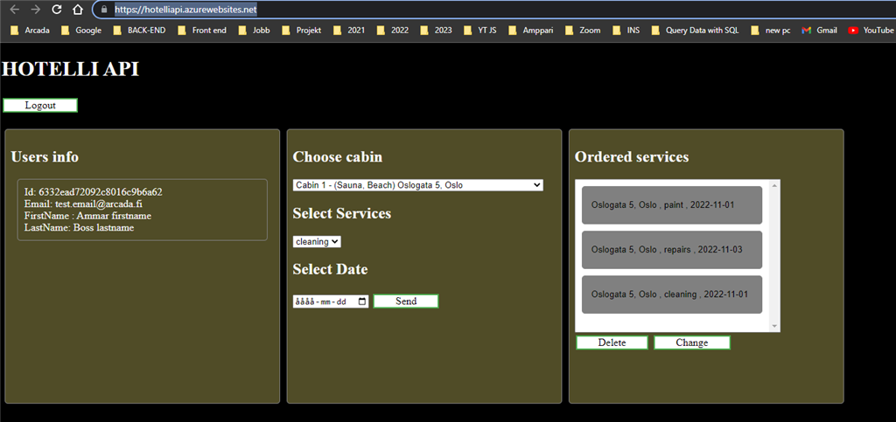

# HOTELLIAPI_WOM
 
Hotel app is an app that works with NoSQL with Mongo database to save the customer's information and token to remember with their login information in local storage so you can log in to the page with the token. at the same time, the server is running on the azure website. So several different servers contact each other to allow the customer to book a hotel room with the address and services needed for their room with the time and date

HOTELLIAPI_WOM
The Github link that has : (Frontend-App)+(Project1+owned)+(Project2-backend-CSO). https://github.com/Ammar-Man/HOTELLIAPI_WOM

Project1+owned https://wom22-ammar.azurewebsites.net/

Projekt2-backend-CSO https://wom22-part2-ammar.azurewebsites.net/

Projekt2 Frontend-App (here you can test the app on the page below!) https://hotelliapi.azurewebsites.net/

you can use email and password to test hotelliapi

Email: ammarTest@arcada.fi Password: Password123

I manage to solve all tasks according to project 2 and project 1 and everything works perfectly!

The app takes a little time the first start because it is the free version just to demonstrate that everything works perfectly

